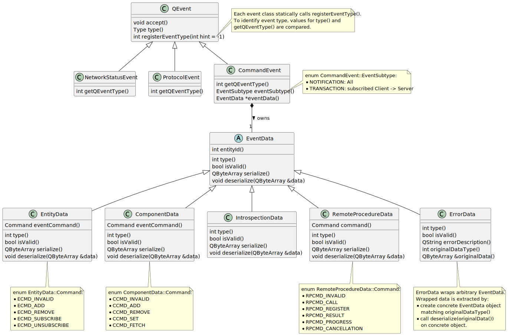
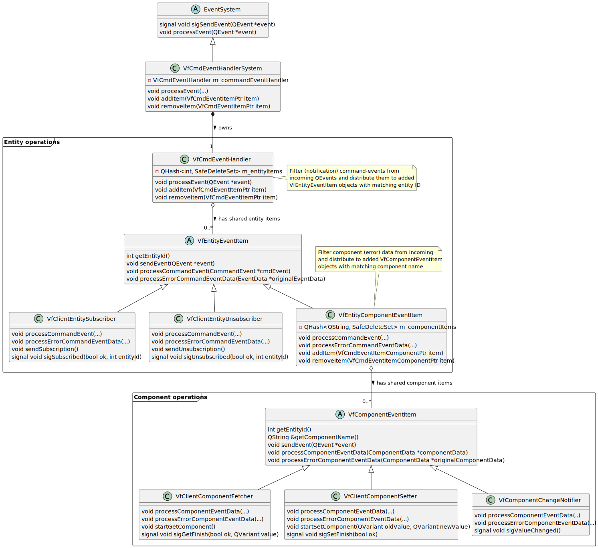

# vein-framework
Vein framework is an event broker system. Data transferred is structured as entity with components:

* Entities are identified by a system-unique integer id
* Entities are containers for components
* Entities should have a component 'EntityName'
* Components are identified by a component name which must be unique within its entity
* Component data is of type QVariant

 Code is divided into the following blocks:
## Framework ([framework](framework))
Framework contains all interfaces for events / event handler and storage system. 

### Class diagram vein events:

## Common convenient code ([convenient-code](convenient-code))
Code to perform common operations in vein-framework. 
### Class diagram convenient code:

## Client libraries ([client-libs](client-libs))

## Server libraries ([server-libs](server-libs))

## Network ([network](network))

